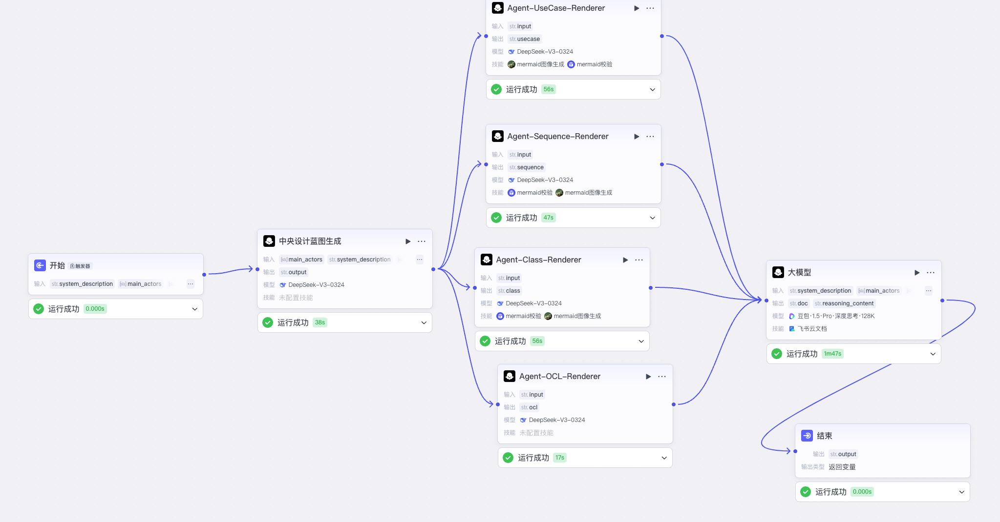

# 任务一

## Prompt

我现在需要你帮我设计一个图书管理系统，图书管理系统中需要包含顾客、图书管理员 

系统的设计应当尽量简洁，按照需求，依次输出这套系统的：用例图、系统顺序图、概念类图以及OCL合约。

## 大模型回复

### **1. 用例图 (Use Case Diagram)**

用例图描述了系统的外部参与者（Actor）与系统提供的功能（Use Case）之间的关系。

- **参与者 (Actors):**

- 顾客 (Customer)
- 图书管理员 (Librarian)

- **用例 (Use Cases):**

- 查询图书: 顾客和管理员都可以查询图书信息。
- 借阅图书: 顾客的核心操作。
- 归还图书: 顾客的核心操作。
- 管理图书: 图书管理员专属，包括添加、删除、更新图书信息。
- 管理顾客: 图书管理员专属，包括注册新顾客、管理顾客信息。

graph TD
  subgraph 图书管理系统
    UC1(查询图书)
    UC2(借阅图书)
    UC3(归还图书)
    UC4(管理图书)
    UC5(管理顾客)
  end

  Customer(顾客) --> UC1
  Customer --> UC2
  Customer --> UC3

  Librarian(图书管理员) --> UC1
  Librarian --> UC4
  Librarian --> UC5

  classDef actor fill:#f9f,stroke:#333,stroke-width:2px;
  class Customer,Librarian actor


### **2. 系统顺序图 (System Sequence Diagram)**

系统顺序图（SSD）将系统视为一个黑盒，只关注参与者与系统之间的事件交互。这里我们为两个核心用例“借阅图书”和“归还图书”创建SSD。

#### **2.1 用例：借阅图书 (Borrow Book)**

此图展示了顾客从系统中借阅一本书的典型交互过程。

sequenceDiagram
  actor 顾客
  participant ":系统" as System

  顾客->>System: 请求借阅图书(顾客ID, 图书ID)
  activate System
  System-->>顾客: 操作成功，告知归还日期
  deactivate System


**交互说明:**

1. **顾客** 向 **系统** 发起借阅请求，并提供自己的身份标识（顾客ID）和想要借阅的图书标识（图书ID）。
2. **系统** 内部处理这个请求（验证顾客资格、检查图书是否可借），处理成功后，向顾客返回成功信息和应归还的日期。

#### **2.2 用例：归还图书 (Return Book)**

此图展示了顾客向系统归还一本书的交互过程。

sequenceDiagram
  actor 顾客
  participant ":系统" as System

  顾客->>System: 请求归还图书(图书ID)
  activate System
  System-->>顾客: 操作成功，确认归还
  deactivate System


**交互说明:**

1. **顾客** 向 **系统** 发起还书请求，并提供归还的图书标识（图书ID）。
2. **系统** 内部处理请求（更新图书状态和借阅记录），并向顾客返回成功信息。

### **3. 概念类图 (Conceptual Class Diagram)**

概念类图描述了系统领域内的核心对象（类）、它们的属性（Attributes）以及它们之间的关系（Associations）。

- **核心概念类:**

- Customer: 顾客信息。
- Book: 图书信息。
- Librarian: 图书管理员信息。
- Loan: 借阅记录。这是一个**关联类**，它关联了一个 Customer 和一本 Book，并包含了借阅本身的属性。

classDiagram
  class Customer {
    +customerID: string
    +name: string
    +maxBooks: int
  }

  class Book {
    +bookID: string
    +title: string
    +author: string
    +status: BookStatus
  }

  enum BookStatus {
    Available
    Borrowed
  }

  class Librarian {
    +librarianID: string
    +name: string
  }

  class Loan {
    +borrowDate: date
    +dueDate: date
  }

  Book -- BookStatus

  Customer "1" -- "0..*" Loan : has
  Book "1" -- "0..*" Loan : is part of

  Librarian "1" ..> "0..*" Book : manages
  Librarian "1" ..> "0..*" Customer : manages


**图解与关系 (Multiplicity):**

- 一个 Customer 可以有零个或多个（0..*）Loan（借阅记录）。一个 Loan 只属于一个（1）Customer。
- 一本 Book 在不同时间可以有零个或多个（0..*）Loan。一个 Loan 只关联一本（1）Book。
- BookStatus 是一个枚举类型，表示书的两种状态：Available（可借阅）或 Borrowed（已借出）。

### **4. OCL 合约 (Object Constraint Language)**

对象约束语言 (OCL) 是一种为UML模型添加精确、无歧义约束的语言。我们为上面的概念类图定义一些重要的业务规则。

#### **4.1 顾客借阅数量限制**

**规则：** 一名顾客同时借阅的图书数量不能超过其最大可借阅数（这里假设为5）。

-- A customer cannot have more than their allowed maximum number of active loans.
context Customer
inv maxBooksPerCustomer:
  self.loan->size() <= 5


- context Customer: 此约束应用于 Customer 类。
- inv maxBooksPerCustomer: 这是一个名为 maxBooksPerCustomer 的不变量 (invariant)，它必须始终为真。
- self.loan->size() <= 5: 对于任意一个顾客实例 (self)，其关联的 Loan 对象数量不能超过5。

#### **4.2 已借出的图书状态必须是 "Borrowed"**

**规则：** 如果一本书存在于一个有效的借阅记录中，那么这本书的状态必须是 Borrowed。反之，如果一本书没有被借出，其状态必须是 Available。

-- A book that is part of a loan must have its status as 'Borrowed'.
context Book
inv bookStatusMustMatchLoanState:
  (self.loan->notEmpty() implies self.status = BookStatus::Borrowed) and
  (self.loan->isEmpty() implies self.status = BookStatus::Available)


- context Book: 此约束应用于 Book 类。
- self.loan->notEmpty(): 检查这本书是否存在关联的 Loan 对象。
- implies self.status = BookStatus::Borrowed: 如果存在借阅记录，那么这本书的状态必须是 Borrowed。

#### **4.3 借阅记录的日期有效性**

**规则：** 在一条借阅记录中，应归还日期 (dueDate) 必须晚于或等于借出日期 (borrowDate)。

-- The due date of a loan must be after or on the borrow date.
context Loan
inv dueDateMustBeAfterBorrowDate:
  self.dueDate >= self.borrowDate


- context Loan: 此约束应用于 Loan 类。
- self.dueDate >= self.borrowDate: 确保 dueDate 属性的值在 borrowDate 当天或之后。

# 任务二

## Prompt

我现在需要你帮我设计一个图书管理系统，图书管理系统中需要包含顾客、图书管理员 

系统的设计应当尽量简洁，按照需求，依次输出这套系统的用例图 

用例图需要使用json的格式进行返回，能够更加清晰的表达模型的需求。

## 大模型回复

``` json
{
  "systemName": "图书管理系统",
  "actors": [
    {
      "name": "顾客",
      "description": "系统的主要用户，能够查询、借阅和归还图书。"
    },
    {
      "name": "图书管理员",
      "description": "系统的管理者，负责维护图书和顾客信息。"
    }
  ],
  "useCases": [
    {
      "id": "UC01",
      "name": "查询图书",
      "description": "根据书名、作者等信息查找图书。",
      "actors": [
        "顾客",
        "图书管理员"
      ]
    },
    {
      "id": "UC02",
      "name": "借阅图书",
      "description": "顾客从图书馆借阅一本或多本书。",
      "actors": [
        "顾客"
      ]
    },
    {
      "id": "UC03",
      "name": "归还图书",
      "description": "顾客将已借阅的图书归还至图书馆。",
      "actors": [
        "顾客"
      ]
    },
    {
      "id": "UC04",
      "name": "管理图书",
      "description": "图书管理员添加新书、删除旧书或更新图书信息。",
      "actors": [
        "图书管理员"
      ]
    },
    {
      "id": "UC05",
      "name": "管理顾客",
      "description": "图书管理员注册新顾客或管理现有顾客的资料。",
      "actors": [
        "图书管理员"
      ]
    }
  ]
}

```

# 任务三




如果图片不可查看，可以查看生成的飞书文档：https://yrrcj5q9w5.feishu.cn/docx/SDBOd9uHxoe5SFxdlq9ctNUJnsb，或者可查看项目中的pdf文件

# 关于「图书管理系统」的系统设计文档

## 项目概述

> 图书管理系统（版本1.0）是一个用于处理图书借阅、归还以及图书上架和下架流程的简单管理系统。主要参与者包括「顾客」（可查询图书信息）和「图书管理员」（可上架新书）。核心功能涵盖顾客的图书信息查询操作，以及图书管理员的新书上架流程，旨在通过系统化管理提升图书资源的利用效率。

## 用例图


点击查看 Mermaid 源码

```Plaintext
%% 用例图：图书管理系统
graph TD
    subgraph 图书管理系统
        actor1[顾客]
        actor2[图书管理员]

        usecase1(查询图书信息)
        usecase2(上架新书)

        actor1 --> usecase1
        actor2 --> usecase2
    end
```

## 时序图

### 查询图书信息时序图

**描述**: 顾客查询图书信息的流程。


点击查看 Mermaid 源码

```Plaintext
sequenceDiagram
    participant 顾客
    participant 图书管理系统
    顾客->>图书管理系统: 请求查询图书信息
    图书管理系统-->>顾客: 返回图书信息
```

### 上架新书时序图

**描述**: 图书管理员上架新书的流程。


点击查看 Mermaid 源码

```Plaintext
sequenceDiagram
    participant 图书管理员
    participant 图书管理系统
    图书管理员->>图书管理系统: 请求上架新书
    图书管理系统-->>图书管理员: 确认新书信息
    图书管理员->>图书管理系统: 提交新书信息
    图书管理系统-->>图书管理员: 返回上架成功
```

## 类图


点击查看 Mermaid 源码

```Plaintext
classDiagram
    class 顾客 {
        +id: String
        +name: String
        +queryBookInfo(): BookInfo
    }

    class 图书管理员 {
        +id: String
        +name: String
        +addNewBook(book: Book): Boolean
    }

    class 图书管理系统 {
        +books: List<Book>
        +queryBookInfo(query: String): BookInfo
        +addNewBook(book: Book): Boolean
    }

    class Book {
        +id: String
        +title: String
        +author: String
        +status: String
    }

    class BookInfo {
        +id: String
        +title: String
        +author: String
        +status: String
    }

    class BookStatus {
        <<enumeration>>
        +available
        +borrowed
        +reserved
    }

    顾客 -- 图书管理系统 : "查询图书信息"
    图书管理员 -- 图书管理系统 : "上架新书"
    图书管理系统 *-- Book : "包含多个Book对象"
    Book -- BookStatus : "状态"
```

## OCL 规则

### 1. 图书状态有效性约束

**上下文**: `Book` 类 **描述**: 确保图书状态只能是有效的预定义值 **规则**:

```Plaintext
inv: self.status = 'available' or self.status = 'borrowed' or self.status = 'reserved'
```

### 2. 上架新书唯一性约束

**上下文**: `图书管理系统` 类的 `addNewBook` 操作 **描述**: 确保上架新书时图书ID在系统中唯一 **规则**:

```Plaintext
context 图书管理系统::addNewBook(book: Book): Boolean
pre: not self.books->exists(b | b.id = book.id)
post: result = true implies self.books->includes(book)
```

## 总结

本设计文档完整覆盖了图书管理系统的核心设计要素，通过用例图明确了系统与参与者的交互边界，时序图详细描述了关键业务流程的执行步骤，类图定义了系统的静态结构和对象关系，OCL规则则从逻辑层面保障了系统的数据完整性和业务规则的正确性。各部分设计相互支撑，共同构建了一个功能清晰、结构合理、约束严谨的图书管理系统解决方案。